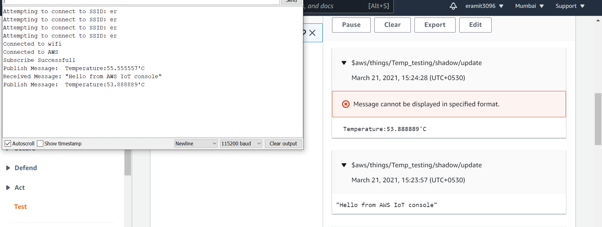

# Aws_iot_core

Author :- Amit Kumar
This repository contains tutorials of Aws_iot_core.
The case study for them is ESP32. The reason for using ESP32 was their popularity.
All the codes were tested on ESP32.

# Repository Structure
Following are the details of the structure of this repository
Here is a screenshot of the AWS_IOT_result

Here is a screenshot of the Result

      THANK YOU
